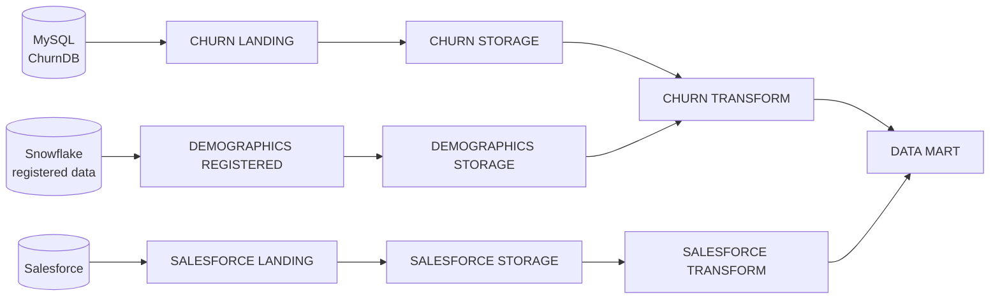

# E2E Customer Churn — QTCP Declarative Pipeline

Declarative pipeline definition for the **E2E Customer Churn** data integration project in **Qlik Talend Cloud Pipelines (QTCP)**, targeting **Snowflake**. The entire pipeline — tasks, datasets, transformations, schedules — is defined as YAML configuration files that can be edited in any code editor and synchronized back into QTCP.

Part of the QTCP **Declarative Pipelines** private preview.

## Pipeline architecture

Three source feeds converge into a dimensional data mart:



| Task | Type | Notes |
|---|---|---|
| CHURN LANDING | `LANDING` | CDC landing from MySQL (subscriptions, usage, service data) |
| SALESFORCE LANDING | `LANDING` | Landing from Salesforce (account, contact, opportunity, user) |
| DEMOGRAPHICS REGISTERED | `REGISTERED_DATA` | Registers demographics data already present in Snowflake |
| CHURN / SALESFORCE / DEMOGRAPHICS STORAGE | `STORAGE` | Stored datasets with rules that uppercase table and column names |
| CHURN TRANSFORM | `TRANSFORM` | Joins churn + demographics data; `SENTIMENT_ANALYSIS` data flow runs Snowflake AI sentiment scoring on the `REVIEW` column |
| SALESFORCE TRANSFORM | `TRANSFORM` | Conforms Salesforce entities |
| DATA MART | `DATAMART` | Star schema: `DIM_*` dimensions and `FACT_SUBSCRIPTIONS`, `FACT_SALESFORCE_OPPORTUNITY` |

Target platform: Snowflake, database `E2E_DEMO_DB`, warehouses `LOAD_WH` (landing) and `SALES_WH` (storage/transform/mart). Storage tasks reload on a 15-minute schedule.

## Repository structure

```
├── README.md                          # This document
├── .gitignore                         # Excludes the preview tooling (schemas, editor/AI config) from the repo
├── qtcp_project.yaml                  # Project identity: name, type, platform, connections
├── qtcp_bindings_definition.json      # Registry (declaration) of all {{variables}} used in the YAML files
├── bindings.json                      # Values for those variables in this environment
└── qtcp_tasks/
    ├── newTaskDefaults.yaml           # Default settings applied to newly created tasks
    └── <TASK NAME>/                   # One folder per task, named exactly after the task in QTCP
        ├── task.yaml                  # Identity + type-specific settings        (always present)
        ├── sourceSelection.yaml       # Which upstream task(s) feed this task    (always present)
        ├── schedule.yaml              # When the task runs                       (optional)
        ├── transformationRules.yaml   # Bulk rules across all datasets           (optional)
        ├── model.yaml                 # Dataset relationships / join keys        (transform & mart tasks)
        ├── datasets/                  # One file per dataset                     (optional)
        │   └── <dataset>.yaml
        └── transformationDataFlows/   # One file per visual data flow            (transform tasks)
            └── <flow>.yaml
```

Two principles govern every file:

- **Delta only** — files contain just the properties that differ from QTCP defaults. Anything not specified takes its default value at import. This is why most files are only a few lines long.
- **IDs are contracts** — every object has a stable `id` (format `<slug>-<suffix>`, e.g. `storage-0ivk`). Other files reference these ids to wire the pipeline together. Never change an existing id; give new objects a new unique id in the same format.

## File reference

### `qtcp_project.yaml` — project definition

The root object of the project. Declares what kind of project this is and which platform it runs on.

```yaml
properties:
  exportVersion: '1.0'
  name: '{{projectName}}'
  space: 'ref{project.current.spaceId}'
  type: DATA_PIPELINE
  platformType: SNOWFLAKE
  platformConnection: '{{platformConnection}}'
  cloudStagingConnection: '{{cloudStagingConnection}}'
settings:
  artifactsNaming:
    prefixSchema: '{{project.current.prefixSchema}}'
```

| Property | Meaning |
|---|---|
| `exportVersion` | Format version of the export (`'1.0'`) |
| `name` | Project display name — bound to the `projectName` variable |
| `space` | Qlik Cloud space the project lives in (resolved by reference) |
| `type` | `DATA_PIPELINE` (this project) or `DATA_MOVEMENT` (replication projects) |
| `platformType` | Target data platform (`SNOWFLAKE` here) |
| `platformConnection` / `cloudStagingConnection` | Connections to the platform and staging area, supplied via variables |
| `settings.artifactsNaming.prefixSchema` | Optional prefix applied to schemas the project creates |

### `qtcp_bindings_definition.json` — variable registry

Declares every `{{variable}}` the YAML files are allowed to reference. Keys mirror `bindings.json`; values here are declarations (mostly empty strings, or defaults that point at other variables). **When you add a new `{{variable}}` to any YAML file, declare it here too** — otherwise import fails.

### `bindings.json` — variable values

Supplies the actual values for this environment. Variables follow a three-level naming convention, from broadest to most specific:

| Level | Pattern | Example |
|---|---|---|
| Project | `<name>` | `"projectName": "E2E Customer Churn"` |
| Task-type defaults | `task-type.<type>.<property>` | `"task-type.storage.warehouseName": "SALES_WH"` |
| Task instance | `task.<taskId>.<property>` | `"task.storage-0ivk.taskSchema": "STORAGE"` |

Values can reference other variables (`"{{task-type.storage.databaseName}}"`) — this is how every storage task inherits `E2E_DEMO_DB` from one place — or look up platform objects by name: `"{{id(connection, ChurnDB.target_snowflake_e2e)}}"`.

The `connectionProperties` block records the type of each source connection (e.g. `repsrc_mysql` for the MySQL CDC source, `external_data_provider` with a `kindId` for Salesforce), so the project can be rebound to equivalent connections in another tenant.

This file contains only names and references — no credentials.

### `qtcp_tasks/newTaskDefaults.yaml` — defaults for new tasks

Per-task-type settings automatically applied to any **new** task created in the project (it does not affect existing tasks). Organized by task type (`landing:`, `storage:`, `knowledgeMart:`, …). In this project it only carries empty LLM settings for the knowledge-mart types.

### `qtcp_tasks/<TASK NAME>/` — one folder per task

The folder name equals the task name shown in QTCP (spaces allowed). Every task type uses the same set of files; which optional files exist depends on what the task does.

#### `task.yaml` — task identity and settings *(required)*

```yaml
properties:
  name: CHURN STORAGE        # display name, matches the folder name
  id: storage-0ivk           # stable id referenced by other files — do not change
  type: STORAGE              # task type, decides which settings apply
settings:
  artifactsLocation:
    internalSchema: '{{task.storage-0ivk.internalSchema}}'
    taskSchema: '{{task.storage-0ivk.taskSchema}}'
    databaseName: '{{task.storage-0ivk.databaseName}}'
  taskRuntime:
    warehouseSelection:
      warehouseName: '{{task.storage-0ivk.warehouseName}}'
```

- `properties.type` — one of: `LANDING`, `LAKE_LANDING`, `STREAMING_LAKE_LANDING`, `REGISTERED_DATA`, `STORAGE`, `QVD_STORAGE`, `TRANSFORM`, `STREAMING_TRANSFORM`, `DATAMART`, `KNOWLEDGE_MART`, `FILE_BASED_KNOWLEDGE_MART`, `LAKEHOUSE_STORAGE`, `LAKEHOUSE_MIRROR`, `REPLICATION` (replication only in `DATA_MOVEMENT` projects).
- `settings` — the valid block depends on `type`; the YAML schema switches automatically. Common blocks seen in this project:
  - `artifactsLocation` — where the task writes (database, task schema, internal schema)
  - `taskRuntime.warehouseSelection` — Snowflake warehouse to run on
  - `errorHandling` — retry policy (`maximumRetrySettings`)
  - `landingDwSettings`, `landingAppRuntime` — landing-task specifics, e.g. `sourceCdcFetchIntervalMinutes: 60`
  - `ddlHandlingPolicy` — how source DDL changes are handled (`addColumn: IGNORE`, `createTable: IGNORE`)

#### `sourceSelection.yaml` — input wiring *(required)*

Declares which upstream tasks feed this task — this is what builds the pipeline graph:

```yaml
includePatterns:
  - sourceTask: transform-drwz            # id from the upstream task.yaml
    tablePattern: '%'                     # SQL-style wildcard: all tables
  - sourceTask: salesforce_transform-aaqj
    tablePattern: '%'
```

For landing tasks the "source" is the external connection (declared via variables) rather than another task.

#### `schedule.yaml` — run schedule *(optional)*

A list of schedules in iCalendar RRULE format:

```yaml
scheduling:
  - schedulingType: TIME_BASED
    timeBasedScheduling:
      schedule:
        - RRULE:FREQ=MINUTELY;INTERVAL=15;BYSECOND=0   # every 15 minutes
      startDateTime: 2024-09-18T15:19:15.3900000Z
      timezone: Etc/UTC
```

Omit the file entirely for tasks that run only on demand.

#### `datasets/<name>.yaml` — per-dataset configuration *(one file per dataset)*

The filename matches the dataset name. Defines where the dataset comes from and any **dataset-level** transformations:

```yaml
properties:
  id: subscriptions-kyi2
  name: subscriptions
  inputDatasets:
    - datasetId: subscriptions          # dataset in the upstream task
      taskId: churn_landing-wjkl        # id of the upstream task
transformations:
  columnTransformations:
    - action: DROP                      # e.g. DROP / ADD / RENAME a column
      columnName: Test
```

Column transformations can also add computed columns, using an `expression` block with an SQL expression statement.

#### `transformationRules.yaml` — bulk rules *(optional)*

Rules applied across **all** datasets of the task, executed in `ordinal` order:

```yaml
rules:
  - ordinal: 0
    actionType: RENAME_TABLE     # what to do (RENAME_TABLE, RENAME_COLUMN, …)
    scopeType: TABLE             # what it applies to (TABLE or COLUMN)
    action:
      renameType: TO_UPPER       # the rename strategy
      value: ''
    name: Capitalize Datasets
```

Rule of thumb: task-wide conventions (naming, casing) go here; changes to a single dataset go in that dataset's file under `datasets/`.

#### `model.yaml` — dataset relationships *(transform and mart tasks)*

The join model between datasets in the task. Each relationship names a source and target entity (by dataset id + owning task id) and the join columns:

```yaml
relationships:
  - sourceEntity:
      datasetId: subscriptions-drw1
      name: SUBSCRIPTIONS
      taskId: transform-drwz
    targetEntity:
      datasetId: demographics-5anq
      name: DEMOGRAPHICS
      taskId: transform-drwz
    columnRelationships:
      - sourceColumn: ACCOUNTID
        targetColumn: ACCOUNTID
    name: SUBSCRIPTIONS_DEMOGRAPHICS_relation
    id: subscriptions_demographics_relation-drxg
```

In this project, CHURN TRANSFORM relates SUBSCRIPTIONS to DEMOGRAPHICS, SERVICE_DATA, USAGE_DATA, and SENTIMENT_ANALYSIS on `ACCOUNTID`.

#### `transformationDataFlows/<name>.yaml` — visual data flows *(transform tasks)*

Each file is one data flow from the QTCP flow designer:

```yaml
name: SENTIMENT_ANALYSIS
context:
  projectId: '{{ref(project.current.projectId)}}'
  dataAppId: transform-drwz        # the task that owns this flow
graph: "{ ...nodes and edges as embedded JSON... }"
modelVersion: '1.0.0'
```

The `graph` property embeds the flow as JSON: `nodes` are sources (`qcdiDataEntitySource`), processors (e.g. `snowflake-ai` sentiment analysis, `join`, `field-remover`), and targets (`qcdiDataEntityTarget`); `edges` connect them. This project's `SENTIMENT_ANALYSIS` flow reads SERVICE_DATA and SUBSCRIPTIONS, scores the `REVIEW` column with Snowflake AI sentiment, inner-joins on `ACCOUNTID`, drops surplus columns, and writes the SENTIMENT_ANALYSIS dataset.

The graph JSON is dense and positional — prefer designing flows in the QTCP UI (or with AI assistance) over hand-editing.

### `.gitignore` — tooling exclusions

Excludes the preview tooling — `schema/`, `.vscode/settings.json`, `CLAUDE.md`, `.github/copilot-instructions.md` — so it never reaches the repository or a QTCP import. The tooling is distributed separately as a ZIP during the preview and dropped into the working copy locally.

## Editing rules

1. **Keep files minimal** — set only what differs from defaults; don't restate default values.
2. **Never change existing `id` values** — `sourceSelection.yaml`, `inputDatasets`, `model.yaml`, and data-flow graphs all reference them.
3. **New variables go in three places** — the YAML property (`'{{myVar}}'`), a declaration in `qtcp_bindings_definition.json`, and a value in `bindings.json`.
4. **No comments** in the YAML/JSON project files — they must contain only data.
5. **Dataset-level changes** belong in `datasets/<name>.yaml`; **task-wide rules** in `transformationRules.yaml`.
6. **Validate before importing** — the schema flags errors live in VS Code, and the Validate API (below) checks the whole project structure.

## Editing locally

1. Clone this repository.
2. Install the **Red Hat YAML extension** in VS Code (`redhat.vscode-yaml`).
3. Extract the Declarative Pipelines preview tooling package (schemas + `.vscode/settings.json` + AI instructions) into the repository root. The tooling is intentionally **not committed** (see `.gitignore`).
4. Open the repository folder in VS Code. Opening any QTCP YAML file should show the matched schema name in the status bar, with hover documentation, auto-complete (`Ctrl+Space`), and live validation.

## Syncing with QTCP

This repository is connected to the QTCP project via GitHub sync:

1. Edit YAML in VS Code.
2. Commit and push to this repository.
3. In QTCP, use **Apply from Remote** on the project to pull the changes.

Alternatively, a ZIP of the repository contents (matching the original export structure) can be imported directly into QTCP.

Before importing, configurations can be checked with the **Validate Project Definitions API**:

```bash
curl https://{tenant}.{region}.qlikcloud.com/api/v1/di-projects/utils/actions/validate-project-definitions \
  -X POST \
  -H "Content-type: multipart/form-data" \
  -H "Authorization: Bearer <access_token>" \
  -F "zip=@/path/to/project.zip"
```

## Documentation

- [Declarative pipelines overview (Qlik help)](https://alphahelp.qliktech.com/rc/en-US/cloud-services-DOC-3820-rc/Subsystems/Hub/Content/Sense_Hub/DataIntegration/DeclarativePipelines/Declarative-pipelines-overview.htm)
- [Developer guide (qlik.dev)](https://preview.qlik.dev/ryidoc-3920-declarative-pipelines/manage/di-projects/declarative-pipelines/)
- [Declarative Pipelines preview forum](https://community.qlik.com/t5/Declarative-Pipelines/gh-p/Declarative_Pipelines)
