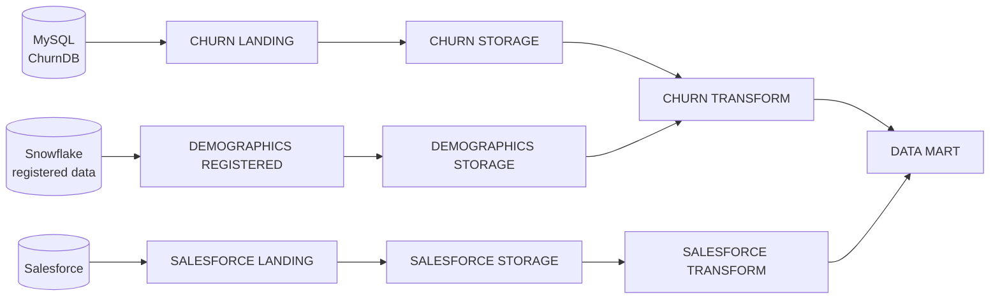

# E2E Customer Churn — QTCP Declarative Pipeline

Declarative pipeline definition for the **E2E Customer Churn** data integration project in **Qlik Talend Cloud Pipelines (QTCP)**, targeting **Snowflake**. The entire pipeline — tasks, datasets, transformations, schedules — is defined as YAML configuration files that can be edited in any code editor and synchronized back into QTCP.

Part of the QTCP **Declarative Pipelines** private preview.

## Pipeline architecture

Three source feeds converge into a dimensional data mart:



| Task | Type | Notes |
|---|---|---|
| CHURN LANDING | `LANDING` | CDC landing from MySQL (subscriptions, usage, service data) |
| SALESFORCE LANDING | `LANDING` | Landing from Salesforce (account, contact, opportunity, user) |
| DEMOGRAPHICS REGISTERED | `REGISTERED_DATA` | Registers demographics data already present in Snowflake |
| CHURN / SALESFORCE / DEMOGRAPHICS STORAGE | `STORAGE` | Stored datasets with rules that uppercase table and column names |
| CHURN TRANSFORM | `TRANSFORM` | Joins churn + demographics data; `SENTIMENT_ANALYSIS` data flow runs Snowflake AI sentiment scoring on the `REVIEW` column |
| SALESFORCE TRANSFORM | `TRANSFORM` | Conforms Salesforce entities |
| DATA MART | `DATAMART` | Star schema: `DIM_*` dimensions and `FACT_SUBSCRIPTIONS`, `FACT_SALESFORCE_OPPORTUNITY` |

Target platform: Snowflake, database `E2E_DEMO_DB`, warehouses `LOAD_WH` (landing) and `SALES_WH` (storage/transform/mart). Storage tasks reload on a 15-minute schedule.

## Repository structure

```
├── qtcp_project.yaml                  # Project identity: name, type (DATA_PIPELINE), platform (SNOWFLAKE)
├── qtcp_bindings_definition.json      # Registry of all {{variables}} referenced by the YAML files
├── bindings.json                      # Values for those variables (connections, databases, warehouses, schemas)
└── qtcp_tasks/
    ├── newTaskDefaults.yaml           # Default settings applied to newly created tasks
    └── <TASK NAME>/                   # One folder per task, named after the task
        ├── task.yaml                  # Identity (name, id, type) + type-specific settings — always present
        ├── sourceSelection.yaml       # Upstream task(s) and table patterns feeding this task — always present
        ├── schedule.yaml              # iCal RRULE schedules — optional
        ├── transformationRules.yaml   # Bulk rules applied across the task (e.g. rename to upper)
        ├── model.yaml                 # Dataset relationships / join keys (transform and mart tasks)
        ├── datasets/*.yaml            # Per-dataset config: inputs and dataset-level transformations
        └── transformationDataFlows/   # Visual data flows as node/edge graphs (transform tasks)
```

Files are **delta only**: they contain just the properties that differ from QTCP defaults, which keeps definitions short. Anything not specified takes its default value at import.

## Editing locally

1. Clone this repository.
2. Install the **Red Hat YAML extension** in VS Code (`redhat.vscode-yaml`).
3. Extract the Declarative Pipelines preview tooling package (schemas + `.vscode/settings.json` + AI instructions) into the repository root. The tooling is distributed separately as a ZIP during the preview and is intentionally **not committed** to this repository (see `.gitignore`).
4. Open the repository folder in VS Code. Opening any QTCP YAML file should show the matched schema name in the status bar, with hover documentation, auto-complete (`Ctrl+Space`), and live validation.

When adding a property that takes a variable value (`{{...}}`), register the variable in `qtcp_bindings_definition.json` as well.

## Syncing with QTCP

This repository is connected to the QTCP project via GitHub sync:

1. Edit YAML in VS Code.
2. Commit and push to this repository.
3. In QTCP, use **Apply from Remote** on the project to pull the changes.

Alternatively, a ZIP of the repository contents (matching the original export structure) can be imported directly into QTCP.

Before importing, configurations can be checked with the **Validate Project Definitions API**:

```bash
curl https://{tenant}.{region}.qlikcloud.com/api/v1/di-projects/utils/actions/validate-project-definitions \
  -X POST \
  -H "Content-type: multipart/form-data" \
  -H "Authorization: Bearer <access_token>" \
  -F "zip=@/path/to/project.zip"
```

## Documentation

- [Declarative pipelines overview (Qlik help)](https://alphahelp.qliktech.com/rc/en-US/cloud-services-DOC-3820-rc/Subsystems/Hub/Content/Sense_Hub/DataIntegration/DeclarativePipelines/Declarative-pipelines-overview.htm)
- [Developer guide (qlik.dev)](https://preview.qlik.dev/ryidoc-3920-declarative-pipelines/manage/di-projects/declarative-pipelines/)
- [Declarative Pipelines preview forum](https://community.qlik.com/t5/Declarative-Pipelines/gh-p/Declarative_Pipelines)
